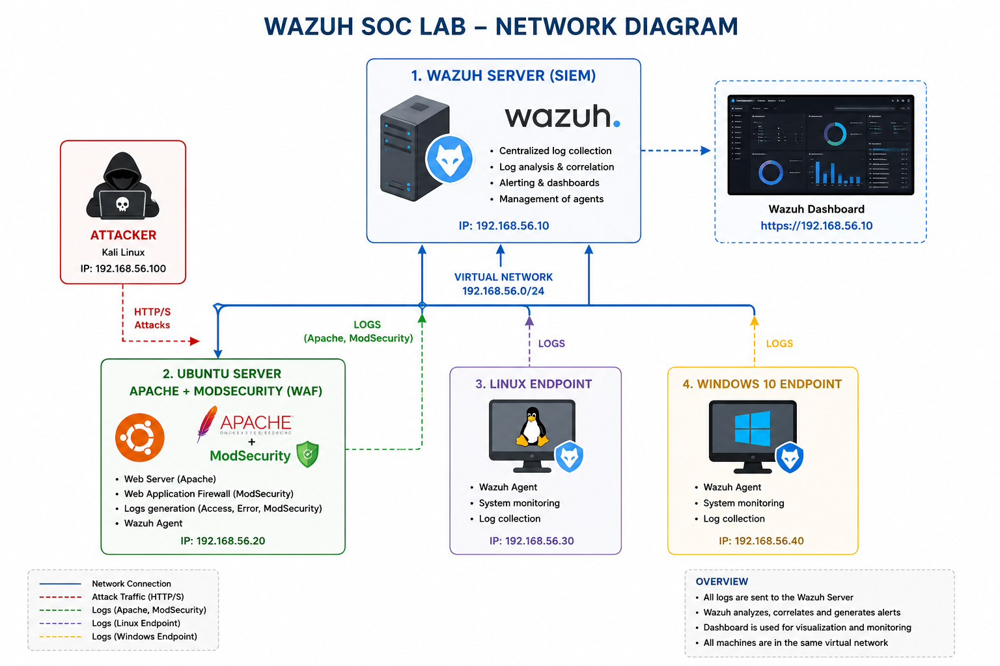

# 🛡️ Wazuh SOC Lab – Open Source Security Monitoring Environment



---

## 📌 Project Overview

This project is a **home SOC laboratory** built using open-source cybersecurity tools.  
It simulates a real-world security monitoring environment with centralized log analysis, threat detection, and web attack monitoring.

The goal is to understand how a **Security Operations Center (SOC)** works by integrating different systems into a centralized SIEM.

---

## 🧱 Architecture

The lab consists of **4 virtual machines**:

- 🧠 **Wazuh SIEM Server**
  - Centralized logging and security event correlation
  - Dashboard for real-time monitoring and alerts

- 🌐 **Ubuntu Server (Apache + ModSecurity WAF)**
  - Web server protected with a Web Application Firewall
  - Generates security logs for web attacks (XSS, SQLi, etc.)

- 🐧 **Linux Endpoint**
  - Monitored user machine with Wazuh agent

- 🪟 **Windows 10 Endpoint**
  - Windows-based machine monitored with Wazuh agent

---

## 🔐 Key Features

- Centralized log collection using Wazuh
- Web attack detection using ModSecurity (WAF)
- Security event classification by severity levels
- Endpoint monitoring (Linux & Windows)
- Detection of simulated DoS attacks
- Real-time dashboard visualization

---

## 🚨 Attack Scenarios Simulated

- 🐞 XSS attack simulation
- 🌐 Web attack detection via ModSecurity rules
- 📊 Log correlation and alert generation in Wazuh SIEM

---

## 🧠 Skills Demonstrated

- SIEM deployment and configuration (Wazuh)
- Log analysis and correlation
- Web Application Firewall (ModSecurity)
- Linux system administration
- Windows endpoint monitoring
- Network security fundamentals
- Blue Team / SOC operations concepts

---

## 📂 Project Structure

```
wazuh-soc-lab/
│
├── README.md
├── architecture/
│   └── network-diagram.png
│
├── configs/
│   ├── wazuh-agent-ossec.conf
│   └── modsecurity.conf
│
├── docs/
│   ├── Architecture.md
│   └── Installation.md
├── screenshots/
│   ├── Dashboard.png
│   └── Severidad_Alerts.png
│   ├── VirtualBox.png
│   └── XSS.png
│   └── modsecurity_log.png
└──
